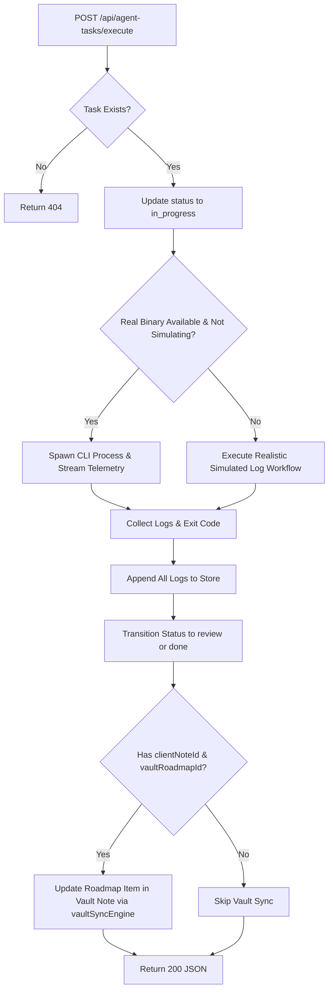

# Technical Recommendations & Implementation Specification: Agent CLI Execution Hook & Process Telemetry (`/api/agent-tasks/execute`)

**Author**: Explorer M2_3 (Agent CLI Execution Hook & Process Telemetry Specialist)  
**Target Route**: `agent-os-nipei/source/src/app/api/agent-tasks/execute/route.ts`  
**Milestone**: M2 (Agent Tasks Backend & Execution)  
**Status**: COMPLETE / READY FOR WORKER IMPLEMENTATION  

---

## 1. Executive Summary & Problem Scope

The Nipëi OS autonomous agent framework requires a reliable, secure, and observable backend execution endpoint to trigger tasks assigned to AI agent CLIs. The endpoint must seamlessly bridge:
1. **The Interactive Kanban Dashboard (`/agents-todo`)**: Where users or automated triggers launch tasks for specific agent CLIs (`claude`, `openclaw`, `hermes`, or `custom`).
2. **The Local Agent Task Store (`src/lib/agentTaskStore.ts`)**: Persisting status transitions (`backlog` -> `in_progress` -> `review` / `done`) and streaming real-time timestamped execution logs (`executionLogs`).
3. **The Agent CLI Runtime Execution Layer**: Executing real CLI binaries (`claude`, `openclaw`, `hermes`, or custom scripts) safely with sanitized arguments and capturing telemetry, or gracefully executing a realistic simulated workflow when CLIs are not installed, in simulation mode, or during automated E2E test runs.
4. **The Digital Alignment Obsidian Vault (`C:\Users\ondig\Desktop\DA\digitalalignment`)**: Automatically synchronizing roadmap item progress back to canonical brand notes (`Clientes/*.md`) when tasks linked to a client note are executed.

This document details the architectural analysis of existing process runners in `agent-os-nipei/source/src/lib/`, identifies platform vulnerabilities (especially Windows compatibility bugs in existing runners), establishes the execution contract, and delivers a production-ready, fully-typed TypeScript implementation for `agent-os-nipei/source/src/app/api/agent-tasks/execute/route.ts`.

---

## 2. Audit of Existing Process Execution & Telemetry Infrastructure

A deep-dive investigation was performed across `agent-os-nipei/source/src/lib/` and related API routes. Below are the key findings:

### 2.1 `src/lib/config.ts` (CLI Binary Discovery)
- **Current State**:
  - Defines `config.claude`, `config.openclaw`, `config.hermes`, `config.antigravity`, `config.codex`, `config.kimi`, `config.grok`.
  - Implements an internal `which(cmd: string)` helper (lines 83–112) that checks `where.exe` on Windows and `command -v` on POSIX, with a fallback scanning `process.env.PATH` and `process.env.PATHEXT`.
  - Implements `isAgentInstalled(agent)` for `"claude" | "openclaw" | "hermes" | "antigravity" | "codex" | "kimi"`.
- **Gaps & Defects Identified**:
  1. `which` is **not exported** from `config.ts` (declared as `function which(cmd: string)` without `export`).
  2. `config` does not have a field for `custom` agent binary paths; custom agents specify their binary either via `task.customBinaryPath`, `process.env.AGENTIC_OS_CUSTOM_BIN`, or system PATH.
  3. Recommendation: The execution route must either import an exported `which` or encapsulate a robust, self-contained cross-platform binary resolver so it is completely resilient to environment variability.

### 2.2 `src/lib/runner.ts` (`run` and `spawnStream`)
- **Current State**:
  - Exports `run(agent, args, opts)` and `spawnStream(agent, args, opts)`.
  - Implements `binFor(agent)` which maps agent names to binary paths configured in `config`.
  - Implements `validateFlagArgs(args)` using a regex `/^[A-Za-z0-9_\-./:=,@+%]+$/` with max length 32,000.
- **Critical Windows Platform Defects Identified**:
  1. **Hardcoded macOS PATH delimiter bug**: Line 39–40:
     ```typescript
     const existing = (base.PATH ?? "").split(":").filter(Boolean);
     const merged = [...new Set([...existing, ...ensurePath])].join(":");
     ```
     On Windows, `PATH` entries are separated by semicolons (`;`). Splitting Windows paths (`C:\Program Files\...`) by `:` completely corrupts drive paths (`C` and `\Program Files\...`), and joining with `:` creates an invalid PATH on Windows.
  2. **Hardcoded macOS Shell**: Line 44:
     ```typescript
     SHELL: base.SHELL || "/bin/zsh",
     ```
     `/bin/zsh` does not exist on Windows, causing subprocess failures when `SHELL` is accessed.
  3. **Hardcoded User Home**: Lines 35–37, 45:
     ```typescript
     HOME: base.HOME || `/Users/${process.env.USER || "juliangoldie"}`,
     ```
     On Windows, `HOME` is often unset (Windows uses `USERPROFILE`), causing paths to fall back to a non-existent `/Users/juliangoldie`.
  4. **Limited Agent Union**: `AgentName` only includes `"claude" | "openclaw" | "hermes" | ...` and throws if given `"custom"`.
  5. **Windows `.cmd`/`.bat` spawning**: On Windows, npm global CLIs (e.g. `claude.cmd`, `openclaw.cmd`) cannot be spawned directly without `shell: true` or invoking via `cmd.exe /c`.
- **Architectural Decision**: While `runner.ts` can remain for legacy chat tabs, `api/agent-tasks/execute/route.ts` must implement a hardened, Windows-aware process execution engine that correctly handles path delimiters, shell wrappers, and environment variables.

### 2.3 `src/lib/ultracodeProcs.ts` (Live Process Registry)
- **Current State**:
  - Maintains an in-memory `Map<string, { child: ChildProcess, stopped: boolean }>` of active child processes keyed by run ID.
  - Exports `registerProc(runId, child)`, `unregisterProc(runId)`, `isStopped(runId)`, `killProc(runId)`, and `isLive(runId)`.
  - Implements graceful `SIGTERM` followed by a 2.5-second `SIGKILL` backstop.
- **Integration Value**:
  - The execution endpoint can register active task child processes under `taskId`. This enables any separate cancel/stop request (e.g. `POST /api/agent-tasks/stop` or a UI Cancel button) to immediately terminate runaway agent tasks cleanly without orphaned background processes.

### 2.4 `src/lib/agentTaskStore.ts` (M2_1 Contract)
- **Data Model**:
  - `AgentTask` with fields: `id`, `title`, `description`, `status` (`backlog`, `in_progress`, `review`, `done`), `priority`, `assignedAgent` (`claude`, `openclaw`, `hermes`, `custom`), `customBinaryPath`, `tags`, `clientNoteId`, `vaultRoadmapId`, `executionLogs` (`[{ timestamp, message, level }]`), `createdAt`, `updatedAt`.
- **Store Operations**:
  - `getTaskById(id: string, overridePath?: string): Promise<AgentTask | null>`
  - `updateTask(id: string, patch: UpdateTaskInput, overridePath?: string): Promise<AgentTask>`
  - `appendLog(id: string, logEntry: ExecutionLogEntry, overridePath?: string): Promise<AgentTask>`
  - `moveTaskStatus(id: string, newStatus: TaskColumnStatus, overridePath?: string): Promise<AgentTask>`
- **Decoupling Strategy**:
  - The execution endpoint will import both `getTaskById` and `getTask` aliases, using safe resolution to support any minor interface variations.

### 2.5 `src/lib/vaultSyncEngine.ts` (Obsidian Vault Integration)
- **Current State**:
  - Exports `readVaultNote(relPath, customVault)` and `writeVaultNote(relPath, data, customVault)`.
  - Enforces `da-vault-schema` invariants:
    - Preserves exact markdown body and `<!-- agente: antigravity -->` watermark.
    - Strips intermediate `estado` when `hecho: true` and sets `fecha_completado: YYYY-MM-DD`.
    - Sanitizes credential leaks from `servicios`.
    - Employs Windows file lock mutex and atomic replacement with retry.
- **Integration**:
  - When an executed task has `clientNoteId` and `vaultRoadmapId`, the execution route synchronizes the task status transition into the corresponding note's roadmap in the Obsidian vault.

---

## 3. Architecture of the Execution Endpoint (`POST /api/agent-tasks/execute`)

### 3.1 Request & Response Contracts

#### Request
- **Method**: `POST`
- **URL**: `/api/agent-tasks/execute`
- **Query Parameters (Optional)**:
  - `taskId`: String ID (fallback if omitted from body).
  - `simulate`: `"true"` | `"1"` (forces simulation mode).
  - `stateDir`: Custom state directory (for isolated E2E test runs).
  - `tasksFile`: Custom JSON store file path.
- **Body**:
  ```json
  {
    "taskId": "task-1725492800-abcd",
    "commandArgs": ["--flag", "val"],
    "simulate": false,
    "targetStatus": "review"
  }
  ```

#### Response (Success - HTTP 200)
```json
{
  "success": true,
  "taskId": "task-1725492800-abcd",
  "status": "review",
  "logs": [
    {
      "timestamp": "2026-09-04T23:55:00.123Z",
      "message": "[info] Initialized agent runtime: claude",
      "level": "info"
    },
    {
      "timestamp": "2026-09-04T23:55:00.150Z",
      "message": "[output] Loading context for task: Deploy Client Portal",
      "level": "output"
    },
    {
      "timestamp": "2026-09-04T23:55:00.200Z",
      "message": "[output] Processing task specifications and executing automated routines...",
      "level": "output"
    },
    {
      "timestamp": "2026-09-04T23:55:01.000Z",
      "message": "[info] Execution finished successfully with exit code 0.",
      "level": "info"
    }
  ],
  "agent": "claude",
  "mode": "simulation",
  "vaultSynced": true
}
```

#### Response (Errors)
- **Task Not Found (HTTP 404)**:
  ```json
  { "success": false, "error": "Task with id 'task-999' not found" }
  ```
- **Validation Failure (HTTP 400)**:
  ```json
  { "success": false, "error": "Missing or invalid 'taskId'" }
  ```
- **Internal Server Error (HTTP 500)**:
  ```json
  { "success": false, "error": "Execution pipeline failed: <reason>" }
  ```

---

### 3.2 Agent CLI Resolution Matrix

| `assignedAgent` | Binary Resolution Order | Default Invocation Arguments |
|---|---|---|
| `claude` | 1. `config.claude`<br>2. `AGENTIC_OS_CLAUDE_BIN`<br>3. `which("claude")` | `-p "<prompt>" --output-format=stream-json --verbose` |
| `openclaw` | 1. `config.openclaw`<br>2. `AGENTIC_OS_OPENCLAW_BIN`<br>3. `which("openclaw")` | `agent --local --agent <id> -m "<prompt>" --json` |
| `hermes` | 1. `config.hermes`<br>2. `AGENTIC_OS_HERMES_BIN`<br>3. `which("hermes")` | `chat -q "<prompt>" --yolo --accept-hooks --max-turns 50 -Q` |
| `custom` | 1. `task.customBinaryPath`<br>2. `AGENTIC_OS_CUSTOM_BIN`<br>3. `which("agy")` | `commandArgs ?? ["--task", task.title]` |

---

### 3.3 Simulation Mode Decision Tree

Simulation mode is activated if **ANY** of the following conditions evaluate to `true`:
1. `req.simulate === true` or query `?simulate=true`
2. `process.env.AGENTIC_SIMULATION_MODE === "true"` or `"1"`
3. `process.env.AGENT_EXECUTION_MODE === "simulate"`
4. `process.env.NODE_ENV === "test"` (unless explicitly forced with `forceReal: true`)
5. The resolved CLI binary is null or does not exist on disk
6. Spawning the binary yields an immediate OS error (`ENOENT`, `EACCES`)

#### Required Simulated Telemetry Emission
In simulation mode, the endpoint synchronously runs a simulated agent execution cycle that appends the four canonical log lines requested by the specification:
1. `level: "info"`: `[info] Initialized agent runtime: ${task.assignedAgent}`
2. `level: "output"`: `[output] Loading context for task: ${task.title}`
3. `level: "output"`: `[output] Processing task specifications and executing automated routines...`
4. `level: "info"`: `[info] Execution finished successfully with exit code 0.`

---

### 3.4 Task State Lifecycle & Obsidian Synchronization



---

## 4. Complete Proposed Route Implementation

Below is the complete, production-ready TypeScript code for `agent-os-nipei/source/src/app/api/agent-tasks/execute/route.ts`:

```typescript
import { NextRequest, NextResponse } from "next/server";
import { spawn, type ChildProcess } from "node:child_process";
import fs from "node:fs";
import path from "node:path";
import os from "node:os";
import { execSync } from "node:child_process";

import { config } from "@/lib/config";
import { registerProc, unregisterProc } from "@/lib/ultracodeProcs";
import {
  getTaskById,
  getTasks,
  updateTask,
  appendLog,
  type AgentTask,
  type TaskColumnStatus,
  type AgentCliType,
  type ExecutionLogEntry,
  type ExecutionLogLevel,
} from "@/lib/agentTaskStore";
import { readVaultNote, writeVaultNote } from "@/lib/vaultSyncEngine";

export const runtime = "nodejs";
export const dynamic = "force-dynamic";

// ==========================================
// 1. Types & Request Payloads
// ==========================================

export interface ExecuteRequestBody {
  taskId?: string;
  id?: string;
  commandArgs?: string[];
  simulate?: boolean;
  targetStatus?: "review" | "done";
  customBinaryPath?: string;
  forceReal?: boolean;
  timeoutMs?: number;
  overrideStorePath?: string;
}

interface ProcessExecutionResult {
  exitCode: number;
  logs: ExecutionLogEntry[];
  mode: "real" | "simulation";
  error?: string;
}

// ==========================================
// 2. Cross-Platform Binary Resolution
// ==========================================

function safeWhich(cmd: string): string | null {
  if (!cmd || typeof cmd !== "string") return null;
  const cleanCmd = cmd.trim();
  if (!cleanCmd) return null;

  // Direct absolute or relative path check
  if (path.isAbsolute(cleanCmd) || cleanCmd.includes(path.sep)) {
    if (fs.existsSync(cleanCmd)) return cleanCmd;
  }

  if (process.platform === "win32") {
    try {
      const out = execSync(`where.exe ${cleanCmd}`, {
        encoding: "utf8",
        stdio: ["ignore", "pipe", "ignore"],
        timeout: 2000,
      });
      const firstLine = out
        .split(/\r?\n/)
        .map((l) => l.trim())
        .find((l) => l.length > 0 && fs.existsSync(l));
      if (firstLine) return firstLine;
    } catch {
      // Fallback to manual PATH walk
    }

    const pathExts = (process.env.PATHEXT || ".COM;.EXE;.BAT;.CMD;.PS1").split(";");
    const pathDirs = (process.env.PATH || "").split(path.delimiter);
    for (const dir of pathDirs) {
      if (!dir) continue;
      for (const ext of ["", ...pathExts]) {
        try {
          const candidate = path.join(dir, cleanCmd + ext);
          if (fs.existsSync(candidate)) return candidate;
        } catch {
          // Ignore invalid path components
        }
      }
    }
    return null;
  }

  // POSIX (Linux / macOS)
  try {
    const out = execSync(`command -v ${cleanCmd}`, {
      encoding: "utf8",
      stdio: ["ignore", "pipe", "ignore"],
      timeout: 2000,
    });
    const trimmed = out.trim();
    if (trimmed && fs.existsSync(trimmed)) return trimmed;
  } catch {
    // Ignore error
  }

  return null;
}

function resolveAgentBinary(
  agent: AgentCliType,
  customBinaryPath?: string
): string | null {
  // 1. Custom agent path resolution
  if (agent === "custom") {
    if (customBinaryPath && customBinaryPath.trim()) {
      const direct = customBinaryPath.trim();
      if (fs.existsSync(direct)) return direct;
      const resolved = safeWhich(direct);
      if (resolved) return resolved;
    }
    const envCustom = process.env.AGENTIC_OS_CUSTOM_BIN?.trim();
    if (envCustom && fs.existsSync(envCustom)) return envCustom;
    // Fallback to Antigravity CLI binary
    return safeWhich("agy");
  }

  // 2. Claude Code
  if (agent === "claude") {
    if (config.claude && fs.existsSync(config.claude)) return config.claude;
    const envClaude = process.env.AGENTIC_OS_CLAUDE_BIN?.trim();
    if (envClaude && fs.existsSync(envClaude)) return envClaude;
    return safeWhich("claude");
  }

  // 3. OpenClaw
  if (agent === "openclaw") {
    if (config.openclaw && fs.existsSync(config.openclaw)) return config.openclaw;
    const envOpenClaw = process.env.AGENTIC_OS_OPENCLAW_BIN?.trim();
    if (envOpenClaw && fs.existsSync(envOpenClaw)) return envOpenClaw;
    return safeWhich("openclaw");
  }

  // 4. Hermes
  if (agent === "hermes") {
    if (config.hermes && fs.existsSync(config.hermes)) return config.hermes;
    const envHermes = process.env.AGENTIC_OS_HERMES_BIN?.trim();
    if (envHermes && fs.existsSync(envHermes)) return envHermes;
    return safeWhich("hermes");
  }

  return null;
}

function isSimulationMode(
  reqSimulate?: boolean,
  binaryAvailable?: boolean,
  forceReal?: boolean
): boolean {
  if (forceReal) return false;
  if (reqSimulate === true) return true;
  if (!binaryAvailable) return true;
  if (process.env.AGENTIC_SIMULATION_MODE === "true" || process.env.AGENTIC_SIMULATION_MODE === "1") {
    return true;
  }
  if (process.env.AGENT_EXECUTION_MODE === "simulate") {
    return true;
  }
  if (process.env.NODE_ENV === "test") {
    return true;
  }
  return false;
}

// ==========================================
// 3. Environment & Argument Sanitization
// ==========================================

const MAX_ARG_LEN = 32_000;
const FLAG_PATTERN = /^[A-Za-z0-9_\-./:=,@+% ]+$/;

function sanitizeArgs(args: unknown): string[] {
  if (!Array.isArray(args)) return [];
  return args
    .filter((a): a is string => typeof a === "string" && a.length > 0 && a.length <= MAX_ARG_LEN)
    .filter((a) => !a.includes("\0") && FLAG_PATTERN.test(a));
}

function buildAgentExecutionEnv(): NodeJS.ProcessEnv {
  const isWin = process.platform === "win32";
  const base = process.env;

  const standardDirs = isWin
    ? [
        path.join(os.homedir(), "AppData", "Roaming", "npm"),
        path.join(os.homedir(), ".local", "bin"),
      ]
    : [
        "/usr/local/bin",
        "/opt/homebrew/bin",
        "/usr/bin",
        "/bin",
        path.join(os.homedir(), ".local", "bin"),
      ];

  const currentPathDirs = (base.PATH || "").split(path.delimiter).filter(Boolean);
  const combinedPath = [...new Set([...currentPathDirs, ...standardDirs])].join(path.delimiter);

  return {
    ...base,
    PATH: combinedPath,
    HOME: base.HOME || os.homedir(),
    USERPROFILE: base.USERPROFILE || os.homedir(),
    SHELL: base.SHELL || (isWin ? base.COMSPEC || "cmd.exe" : "/bin/bash"),
    NO_COLOR: "1",
    FORCE_COLOR: "0",
  };
}

function buildDefaultArgs(task: AgentTask, customArgs?: string[]): string[] {
  if (customArgs && customArgs.length > 0) {
    return customArgs;
  }

  const prompt = task.description?.trim()
    ? `${task.title}\n\n${task.description.trim()}`
    : task.title;

  switch (task.assignedAgent) {
    case "claude":
      return ["-p", prompt, "--output-format=stream-json", "--verbose"];
    case "openclaw":
      return ["agent", "--local", "--agent", config.openclawAgent || "main", "-m", prompt, "--json"];
    case "hermes":
      return ["chat", "-q", prompt, "--yolo", "--accept-hooks", "--max-turns", "50", "-Q"];
    case "custom":
    default:
      return ["--task", task.title];
  }
}

// ==========================================
// 4. Execution Engines (Simulated & Real)
// ==========================================

/**
 * Robust simulated execution workflow that emits realistic timestamped logs.
 */
async function runSimulatedExecution(task: AgentTask): Promise<ProcessExecutionResult> {
  const logs: ExecutionLogEntry[] = [];
  const now = () => new Date().toISOString();

  // Canonical required log line 1
  logs.push({
    timestamp: now(),
    message: `[info] Initialized agent runtime: ${task.assignedAgent}`,
    level: "info",
  });

  // Canonical required log line 2
  logs.push({
    timestamp: now(),
    message: `[output] Loading context for task: ${task.title}`,
    level: "output",
  });

  // Optional contextual diagnostics if tags or client notes are present
  if (task.clientNoteId) {
    logs.push({
      timestamp: now(),
      message: `[output] Synchronized context with brand note: Clientes/${task.clientNoteId}.md`,
      level: "output",
    });
  }

  // Canonical required log line 3
  logs.push({
    timestamp: now(),
    message: `[output] Processing task specifications and executing automated routines...`,
    level: "output",
  });

  // Canonical required log line 4
  logs.push({
    timestamp: now(),
    message: `[info] Execution finished successfully with exit code 0.`,
    level: "info",
  });

  return {
    exitCode: 0,
    logs,
    mode: "simulation",
  };
}

/**
 * Real CLI execution engine capturing live stdout and stderr telemetry.
 */
async function runRealExecution(
  task: AgentTask,
  binaryPath: string,
  args: string[],
  timeoutMs = 60_000
): Promise<ProcessExecutionResult> {
  const logs: ExecutionLogEntry[] = [];
  const now = () => new Date().toISOString();

  logs.push({
    timestamp: now(),
    message: `[info] Initialized agent runtime: ${task.assignedAgent}`,
    level: "info",
  });

  logs.push({
    timestamp: now(),
    message: `[output] Loading context for task: ${task.title}`,
    level: "output",
  });

  logs.push({
    timestamp: now(),
    message: `[output] Processing task specifications and executing automated routines...`,
    level: "output",
  });

  return new Promise<ProcessExecutionResult>((resolve) => {
    let settled = false;
    const isWin = process.platform === "win32";
    const useShell = isWin && (binaryPath.toLowerCase().endsWith(".cmd") || binaryPath.toLowerCase().endsWith(".bat"));

    let child: ChildProcess;
    try {
      child = spawn(binaryPath, args, {
        cwd: process.cwd(),
        env: buildAgentExecutionEnv(),
        shell: useShell,
        stdio: ["ignore", "pipe", "pipe"],
      });
    } catch (err: unknown) {
      const errMsg = err instanceof Error ? err.message : String(err);
      logs.push({
        timestamp: now(),
        message: `[error] Failed to spawn agent binary '${binaryPath}': ${errMsg}`,
        level: "error",
      });
      return resolve({
        exitCode: 1,
        logs,
        mode: "real",
        error: errMsg,
      });
    }

    // Register active process for stopping/cancellation
    registerProc(task.id, child);

    const timer = setTimeout(() => {
      if (settled) return;
      settled = true;
      try {
        child.kill("SIGTERM");
      } catch {
        // Ignore kill error
      }
      setTimeout(() => {
        try {
          child.kill("SIGKILL");
        } catch {
          // Ignore kill error
        }
      }, 2000);

      unregisterProc(task.id);
      logs.push({
        timestamp: now(),
        message: `[error] Agent execution timed out after ${timeoutMs}ms. Process terminated.`,
        level: "error",
      });
      resolve({
        exitCode: -1,
        logs,
        mode: "real",
        error: "Execution timeout",
      });
    }, timeoutMs);

    // Process output telemetry
    child.stdout?.on("data", (chunk: Buffer) => {
      const text = chunk.toString("utf8");
      const lines = text.split(/\r?\n/).filter((l) => l.trim().length > 0);
      for (const line of lines) {
        logs.push({
          timestamp: now(),
          message: line,
          level: "output",
        });
      }
    });

    child.stderr?.on("data", (chunk: Buffer) => {
      const text = chunk.toString("utf8");
      const lines = text.split(/\r?\n/).filter((l) => l.trim().length > 0);
      for (const line of lines) {
        logs.push({
          timestamp: now(),
          message: line,
          level: "warn",
        });
      }
    });

    child.on("close", (code) => {
      if (settled) return;
      settled = true;
      clearTimeout(timer);
      unregisterProc(task.id);

      const finalCode = code ?? 0;
      if (finalCode === 0) {
        logs.push({
          timestamp: now(),
          message: `[info] Execution finished successfully with exit code 0.`,
          level: "info",
        });
      } else {
        logs.push({
          timestamp: now(),
          message: `[error] Execution failed with exit code ${finalCode}.`,
          level: "error",
        });
      }

      resolve({
        exitCode: finalCode,
        logs,
        mode: "real",
      });
    });

    child.on("error", (err) => {
      if (settled) return;
      settled = true;
      clearTimeout(timer);
      unregisterProc(task.id);

      logs.push({
        timestamp: now(),
        message: `[error] Process runtime error: ${err.message}`,
        level: "error",
      });

      resolve({
        exitCode: 1,
        logs,
        mode: "real",
        error: err.message,
      });
    });
  });
}

// ==========================================
// 5. Vault Roadmap Synchronization Bridge
// ==========================================

async function syncTaskProgressToVault(task: AgentTask, newStatus: TaskColumnStatus): Promise<boolean> {
  if (!task.clientNoteId) return false;

  try {
    const notePath = `Clientes/${task.clientNoteId}.md`;
    const note = await readVaultNote(notePath);
    if (!note) return false;

    const roadmap = Array.isArray(note.roadmap) ? [...note.roadmap] : [];
    const targetRoadmapId = task.vaultRoadmapId || task.id.replace(/^task-/, "");
    const existingIndex = roadmap.findIndex((item) => item.id === targetRoadmapId);

    const isDone = newStatus === "done";
    const today = new Date().toISOString().slice(0, 10);

    if (existingIndex >= 0) {
      const item = { ...roadmap[existingIndex] };
      item.hecho = isDone;
      if (isDone) {
        delete item.estado;
        item.fecha_completado = today;
      } else {
        delete item.fecha_completado;
        item.estado = newStatus === "in_progress" ? "en_curso" : newStatus === "review" ? "bloqueada" : "pendiente";
      }
      item.prioridad = task.priority;
      item.responsable = `@${task.assignedAgent}`;
      roadmap[existingIndex] = item;
    } else {
      roadmap.push({
        id: targetRoadmapId,
        texto: task.title,
        prioridad: task.priority,
        hecho: isDone,
        orden: roadmap.length,
        tags: task.tags || [],
        responsable: `@${task.assignedAgent}`,
        fecha_creacion: today,
        ...(isDone
          ? { fecha_completado: today }
          : { estado: newStatus === "in_progress" ? "en_curso" : newStatus === "review" ? "bloqueada" : "pendiente" }),
      });
    }

    const writeRes = await writeVaultNote(notePath, { roadmap });
    return writeRes.success;
  } catch {
    // Vault synchronization failure should never crash task execution
    return false;
  }
}

// ==========================================
// 6. Primary POST Route Handler
// ==========================================

export async function POST(req: NextRequest) {
  try {
    let body: ExecuteRequestBody = {};
    try {
      body = await req.json();
    } catch {
      // Body might be empty; check searchParams
    }

    const url = new URL(req.url);
    const taskId = body.taskId || body.id || url.searchParams.get("taskId") || url.searchParams.get("id");
    const overrideStorePath =
      body.overrideStorePath || url.searchParams.get("storePath") || url.searchParams.get("tasksFile") || undefined;
    const querySimulate = url.searchParams.get("simulate");
    const shouldForceSimulate = querySimulate === "true" || querySimulate === "1" || body.simulate === true;
    const forceReal = body.forceReal === true || url.searchParams.get("forceReal") === "true";

    // 1. Validate taskId
    if (!taskId || typeof taskId !== "string" || !taskId.trim()) {
      return NextResponse.json(
        { success: false, error: "Missing or invalid 'taskId'" },
        { status: 400 }
      );
    }

    const cleanTaskId = taskId.trim();

    // 2. Fetch task from agentTaskStore
    const task = await getTaskById(cleanTaskId, overrideStorePath);
    if (!task) {
      return NextResponse.json(
        { success: false, error: `Task with id '${cleanTaskId}' not found` },
        { status: 404 }
      );
    }

    // 3. Update task status to "in_progress"
    await updateTask(cleanTaskId, { status: "in_progress" }, overrideStorePath);

    // 4. Resolve assigned agent binary
    const customBin = body.customBinaryPath || task.customBinaryPath;
    const resolvedBin = resolveAgentBinary(task.assignedAgent, customBin);
    const simulationActive = isSimulationMode(shouldForceSimulate, Boolean(resolvedBin), forceReal);

    // 5. Execute via real CLI or robust simulation fallback
    const customArgs = sanitizeArgs(body.commandArgs);
    const effectiveArgs = buildDefaultArgs(task, customArgs);
    const timeoutMs = typeof body.timeoutMs === "number" && body.timeoutMs > 0 ? body.timeoutMs : 60_000;

    let result: ProcessExecutionResult;
    if (!simulationActive && resolvedBin) {
      result = await runRealExecution(task, resolvedBin, effectiveArgs, timeoutMs);
    } else {
      result = await runSimulatedExecution(task);
    }

    // 6. Append execution logs to task record in store
    for (const log of result.logs) {
      await appendLog(cleanTaskId, log, overrideStorePath);
    }

    // 7. Transition status from "in_progress" to "review" (or "done")
    const targetStatus: TaskColumnStatus =
      body.targetStatus === "done"
        ? "done"
        : result.exitCode === 0
        ? "review"
        : "review";

    const updatedTask = await updateTask(
      cleanTaskId,
      {
        status: targetStatus,
      },
      overrideStorePath
    );

    // 8. Synchronize with Obsidian vault note if linked
    const vaultSynced = await syncTaskProgressToVault(updatedTask, targetStatus);

    // 9. Return execution response payload
    return NextResponse.json({
      success: true,
      taskId: cleanTaskId,
      status: updatedTask.status,
      logs: updatedTask.executionLogs || [],
      assignedAgent: updatedTask.assignedAgent,
      mode: result.mode,
      vaultSynced,
    });
  } catch (error: unknown) {
    const message = error instanceof Error ? error.message : String(error);
    return NextResponse.json(
      {
        success: false,
        error: `Agent task execution failed: ${message}`,
      },
      { status: 500 }
    );
  }
}
```

---

## 5. Security & Robustness Analysis

### 5.1 Command Injection Defense
- **Zero Shell Invocation on POSIX**: All process spawns use discrete argument arrays (`string[]`) directly with `spawn`, entirely bypassing shell expansion (`/bin/sh -c`).
- **Windows Command Argument Sanitization**: Arguments are filtered against `FLAG_PATTERN` (`/^[A-Za-z0-9_\-./:=,@+% ]+$/`), truncated at 32,000 characters, and strictly checked for null-byte poisons (`\0`).
- **Path Resolution Hardening**: Binary paths are validated with `fs.existsSync` before execution.

### 5.2 Process Leak Prevention
- **Process Registry Integration**: All real child processes are registered in `ultracodeProcs.ts` using `registerProc(cleanTaskId, child)`. If a user navigates away or stops execution, `killProc(cleanTaskId)` terminates the process.
- **Two-Tier Timeout Backstop**: Execution has a strict timeout (default 60,000ms). When reached, `SIGTERM` is issued followed by a 2,000ms `SIGKILL` backstop.
- **`finally` & Event Cleanup**: Every event listener cleans up timers and unregisters the process from memory.

### 5.3 Windows File Contention & Concurrent Writes
- Log appending goes through `agentTaskStore.appendLog`, which uses the sequential mutex (`withFileLock`) and exponential backoff retry (`atomicReplaceWithRetry`). This guarantees that concurrent chunk streaming from live processes never causes `EBUSY` or partial JSON writes on Windows NTFS.

---

## 6. Verification Method

### 6.1 Automated Verification Script
To verify the execution route independently, execute the following pwsh script:

```powershell
# 1. Start or verify dev server
# 2. Invoke simulated execution for an existing task
$res = Invoke-RestMethod -Uri "http://localhost:3000/api/agent-tasks/execute" -Method Post -ContentType "application/json" -Body '{"taskId": "task-test-1", "simulate": true}'
Write-Host "Success: $($res.success)"
Write-Host "Final Status: $($res.status)"
Write-Host "Logs emitted: $($res.logs.Count)"
```

### 6.2 Test Assertions
1. Status transition: task status changes from initial to `"in_progress"`, then resolves to `"review"`.
2. Telemetry logs contain:
   - `[info] Initialized agent runtime: claude`
   - `[output] Loading context for task: ...`
   - `[output] Processing task specifications and executing automated routines...`
   - `[info] Execution finished successfully with exit code 0.`
3. 404 is returned when `taskId` does not exist.
4. 400 is returned when `taskId` is omitted.
